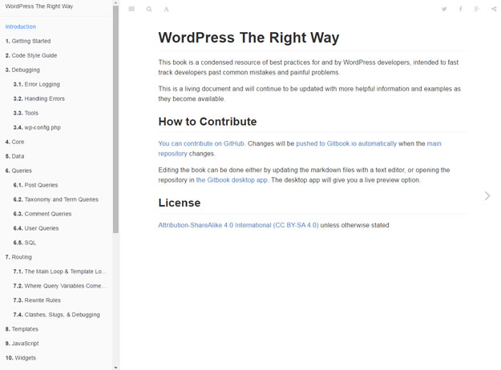

# Gitbook 上手指南

> Gitbook是一个命令行工具，可以把你的Markdown文件汇集成电子书，并提供PDF等多种格式输出。你可以把Gitbook生成的HTML发布出来，就形成了一个简单的静态网站。

<del>它不是介绍git使用教程的书籍<del>


## 注册账户
去 [Gitbook](https://www.gitbook.com/) 官网自行注册即可。

## 下载编辑器
Gitbook为我们提供了一个略强大的[编辑器](https://www.gitbook.com/editor)(点击可到下载页面，提供了Linux、Windows、Mac三个版本)

## Gitbook的基本规则
> Gitbook需要2个最基本的文件：

* README.md
* SUMMARY.md
* README.md是关于书的介绍，也就是首页的内容介绍。
* SUMMARY.md中则包含了书目，即章节结构，它的格式大致

```
* [第1章](c1.md)
    * [第1节](c1s1.md)
    * [第2节](c1s2.md)
* [第2章](c2.md)
```

## 安装gitbook-cli

```bash
$ npm install gitbook-cli -g
```

## 发布预览
进入Gitbook源文件目录(即markdown文件目录)，然后执行下面的命令，即可在本地浏览器端预览Gitbook发布后的效果
```bash
# 发布到当前目录下面的_book目录
$ gitbook build .

# 创建一个本地web server 在浏览器端实时预览效果
$ gitbook serve -p 8080 .
```

命令 `build` 和 `serve` 的参数为:
```bash
-o, --output <directory>  输出文件件, 默认为 ./_book
-f, --format <name>       产生的书籍的类型, 默认为静态站点, 可用的格式为: site, page, ebook, json
--config <config file>    配置文件, 默认为 book.js 或 book.json
```


像下面的样子



位于左侧书目顶部的Introduction一节就编译自README.md(也就是首页内容)，左侧目录结构树则来自SUMMARY.md。

## book.json配置
下面是Gitbook的一些配置选项说明

```javascript
{
    // 输出文件夹
    // 注意: 它会覆盖命令行传入的参数
    // 不建议在此文件中配置
    "output": null,
    // 产生的书籍的类型
    // 注意: 它会覆盖命令行传入的参数
    // 不建议在此文件中配置
    "generator": "site",
    // 图书标题和描述 (默认从README抽取)
    "title": null,
    "description": null,
    // 对于ebook格式, 扩展名the extension to use for generation (default is detected from output extension)
    // "epub", "pdf", "mobi"
    // 注意: 它会覆盖命令行传入的参数
    // 不建议在此文件中配置
    "extension": null,
    // GitHub 信息(defaults are extracted using git)
    "github": null,
    "githubHost": "https://github.com/",
    // 插件列表, can contain "-name" for removing default plugins
    "plugins": [],
    // 插件通用配置
    "pluginsConfig": {
        "fontSettings": {
            "theme": "sepia", "night" or "white",
            "family": "serif" or "sans",
            "size": 1 to 4
        }
    },
    // 模版中的链接 (null: default, false: remove, string: new value)
    "links": {
    	// Custom links at top of sidebar
    	"sidebar": {
    	    "Custom link name": "https://customlink.com"
    	},
        // Sharing links
        "sharing": {
            "google": null,
            "facebook": null,
            "twitter": null,
            "weibo": null,
            "all": null
        }
    },
    // PDF 参数
    "pdf": {
        // Add toc at the end of the file
        "toc": true,
        // Add page numbers to the bottom of every page
        "pageNumbers": false,
        // Font size for the fiel content
        "fontSize": 12,
        // Paper size for the pdf
        // Choices are [u’a0’, u’a1’, u’a2’, u’a3’, u’a4’, u’a5’, u’a6’, u’b0’, u’b1’, u’b2’, u’b3’, u’b4’, u’b5’, u’b6’, u’legal’, u’letter’]
        "paperSize": "a4",
        // Margin (in pts)
        // Note: 72 pts equals 1 inch
        "margin": {
            "right": 62,
            "left": 62,
            "top": 36,
            "bottom": 36
        }
    }
}
```

## 参考
* [https://github.com/GitbookIO/git](https://github.com/GitbookIO/git)
* [使用Gitbook制作电子书](http://www.ituring.com.cn/article/127645)