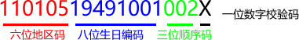

# 身份证校验算法说明
>根据〖中华人民共和国国家标准 GB 11643-1999〗中有关公民身份号码的规定，中国大陆公民身份号码是一组特征组合码，由十七位数字本体码和一位校验码组成。

15位校验规则：6位地址编码+6位出生日期+3位顺序号
18位校验规则：6位地址编码+8位出生日期+3位顺序号+1位校验位

以下针对18位的身份证校验规则进行说明

## 结构和形式
> 排列顺序从左至右依次为：六位数字地址码，八位数字出生日期码，三位数字顺序码和一位数字校验码。



`6位地址编码+8位出生日期+3位顺序号+1位校验位`

**1、地址码**
表示编码对象常住户口所在县(市、旗、区)的行政区划代码，按GB/T2260的规定执行。

**2、出生日期码**
表示编码对象出生的年、月、日，按GB/T7408的规定执行，年、月、日代码之间不用分隔符。 

**3、顺序码**
表示在同一地址码所标识的区域范围内，对同年、同月、同日出生的人编定的顺序号，顺序码的奇数分配给男性，偶数分配给女性。

**4、校验码**
根据前面十七位数字码，按照ISO 7064:1983.MOD 11-2校验码计算出来的检验码。

## 校验码计算方式
计算公式如下：
```javascript
∑(Ai*Wi)(mod 11)
```
在上公式中：
`i`：表示号码字符从由至左包括校验码在内的位置序号； 
`Ai`：表示第i位置上的号码字符值； 
`Wi`：示第i位置上的加权因子，其数值依据公式Wi=2^(n-1）(mod 11)计算得出。

按照上公式计算得出如下步骤

```
1. 将前面的身份证号码17位数分别乘以不同的系数。从第一位到第十七位的系数分别为：7 9 10 5 8 4 2 1 6 3 7 9 10 5 8 4 2
2. 将这17位数字和系数相乘的结果相加。
3. 用加出来和除以11，看余数是多少？
4. 余数只可能有0 1 2 3 4 5 6 7 8 9 10这11个数字。其分别对应的最后一位身份证的号码为1 0 X 9 8 7 6 5 4 3 2。
5. 通过上面得知如果余数是2，就会在身份证的第18位数字上出现罗马数字的Ⅹ。如果余数是10，身份证的最后一位号码就是2。
```

现假定，某男性公民身份证号码本体码为`34052419800101001?`
```
i     18 17 16 15 14 13 12 11 10 9 8 7 6  5 4 3 2 1
Ai    3  4  0  5  2  4  1  9  8  0 0 1 0  1 0 0 1 ?
Wi    7  9  10 5  8  4  2  1  6  3 7 9 10 5 8 4 2
Ai*Wi 21 36 0  25 16 16 2  9  48 0 0 9 0  5 0 0 2 ?

余数   0 1 2 3 4 5 6 7 8 9 10
校验码 1 0 X 9 8 7 6 5 4 3 2

根据上面的公式带入上面的值：
∑(Ai*Wi) = (21+36+0+25+16+16+2+9+48+0+0+9+0+5+0+0+2) = 189
189%11 = 2
∑(Ai*Wi)(mod 11) = 2
根据上表查出结果为2的余数对应的身份证校验码为X，
故该公民的身份证号码应该为：34052419800101001X
```

## 代码实现
现假定，某身份证号为`340524198001010012`，校验该身份证是否有效
```javascript
var idcard = '340524198001010012';

// 校验码
var parity = [ 1, 0, 'X', 9, 8, 7, 6, 5, 4, 3, 2 ];

var sum = 0;
for (var i = 17; i >= 0; i--) {
    var wi = Math.pow(2, i)%11;
    var ai = idcard.charAt(17-i);

    sum += ai*wi;
}

var mod = sum%11;

if(parity[mod] != idcard.charAt[17]){
    console.log(false);
} else {
    console.log(true);
}

```
